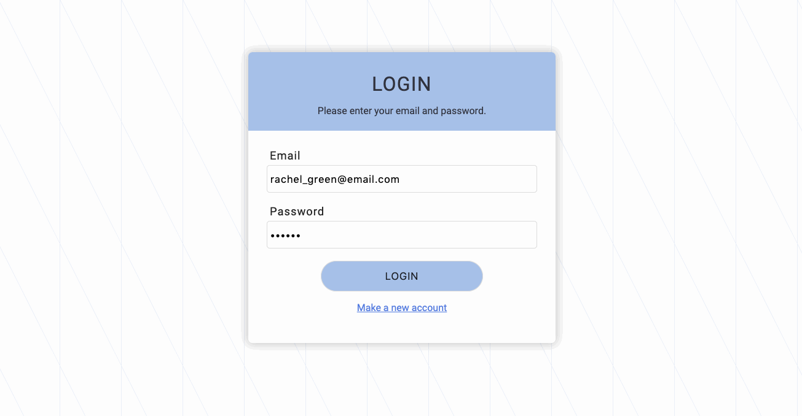
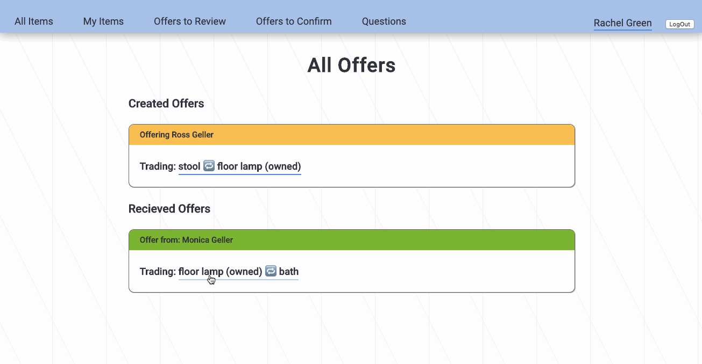
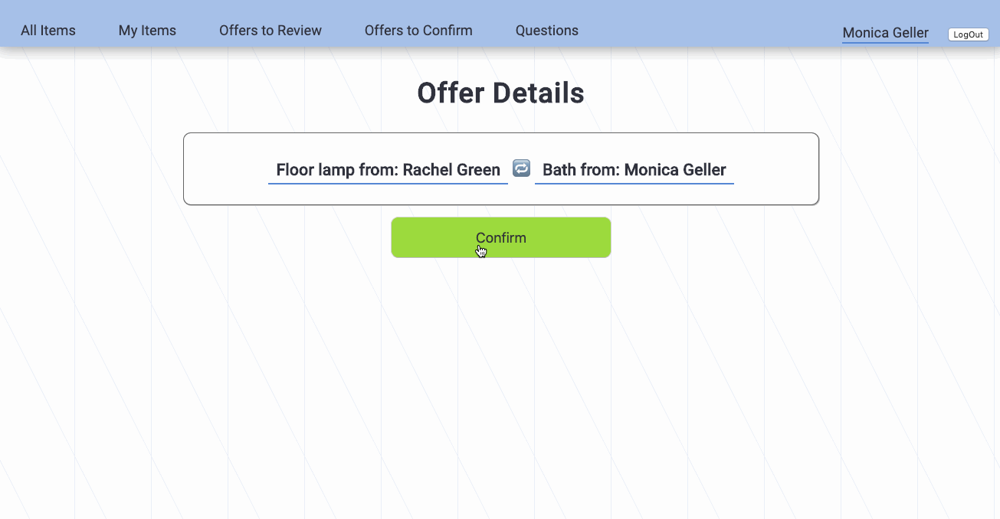
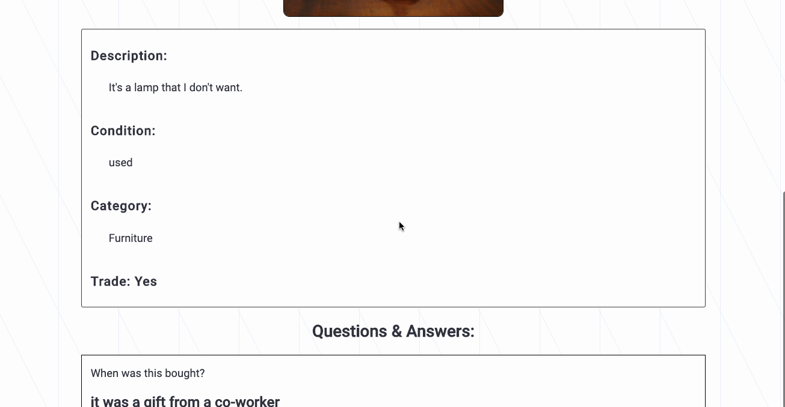

<h1 align="center">Free Trade 🔁 ✨ </h1>

  A <code>Ruby on Rails</code> web app for trading your unwanted item for a better one.

  Built with ❤︎ by
  <a href="https://github.com/janetmndz">Janet Mendez</a> and
  <a href="https://github.com/Gulnoz">
    Gulnoza Muminova-Boltaeva
  </a>

 

## See it Live: [freetrade-flatiron.herokuapp.com/](http://freetrade-flatiron.herokuapp.com)

## Tech Stack
This web app makes use of the following:
- Ruby [2.6.1]
- Rails [~> 5.2.3] - MVC web framework
- PostgreSQL [>= 0.18, < 2.0] - Database  
- SCSS [~> 5.0] - CSS pre-processor
- bcrypt [~> 3.1.7] - Gem for encryption
- Heroku - App deployment 

## Prerequisites
Before you begin, ensure you have installed the latest version of:

- [**Ruby**](https://www.ruby-lang.org/en/)
- [**Rails**](https://rubyonrails.org/)
- [**PostgreSQL**](https://www.postgresql.org/)

## Installing
- Clone this repo to your local machine `git clone <this-repo-url>`
- `cd` into the cloned repo
- run `bundle install`
- Ensure you have PostgreSQL running
- run `rails db:create` to create a database locally.
- run `rails db:migrate` to create tables into the database.
- run `rails db:seed` to create seed data.
- run `rails s` to run the server. 

## Features

Upon log in / sign up with a valid email address, users can see all items currently being offered.

Users can make offers to take their item for another. Or, users can choose to accept an offer already made on one of their items by another user.

Both users have to confirm in for a trade to occur. After trading, users have the option to leave a review about their experience. 

For better user experience, users can leave questions about items they wish to trade and answer questions for their items.

